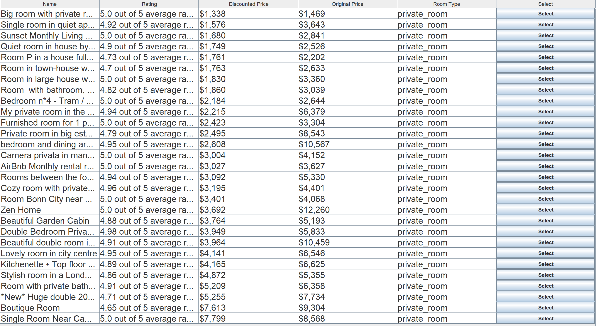
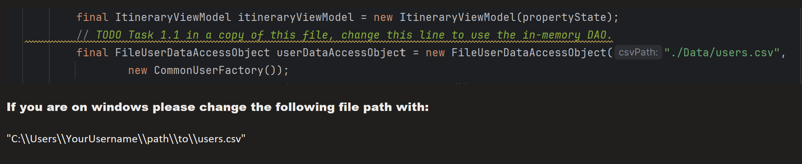
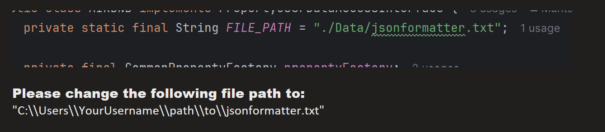

# **Cost-to-Go-UofT**

## **Summary**

**Cost-to-Go-UofT** is a comprehensive tool designed to assist users in planning their study abroad experience. This tool goes beyond merely helping users find a suitable university program—it also provides personalized recommendations for flights and accommodations. Users receive a final itinerary summarizing all the relevant information, making it easier to organize their study abroad plans.

This application was inspired by feedback regarding the University of Toronto's study abroad page, which users often found overwhelming and insufficient. The original page lacked detailed information, such as rental and flight costs, leaving users without a clear picture of the full experience. **Cost-to-Go-UofT** fills these gaps by offering an all-in-one solution.

---

## **Group Members**

- **Muhtasim Khan** ([muhtasim7](https://github.com/muhtasim7))
- **Alisa Iskakova** ([alisa-isk](https://github.com/alisa-isk))
- **Ariuntuya Ganbold** ([ambutsa](https://github.com/ambutsa))
- **Sanyukta Negi** ([sanyuktanegi](https://github.com/sanyuktanegi))
- **Rosa Martinez** ([rosamartinezz](https://github.com/rosamartinezz))

---

## **Table of Contents**

1. [Features](#features)
2. [Getting Started](#getting-started)
3. [API Integrations](#api-integrations)
4. [Usage](#usage)
5. [Feedback](#feedback)
6. [Contribution](#contribution)
7. [License](#license)

---

## **Features**

- **User Account Management**: Users can create an account to store preferences and personal details.  
    
  

- **University Selection**: Provides resources for flights and accommodations in the university's city.

- **Flight Recommendations**: Suggests flights tailored to the user's preferences.

- **Accommodation Recommendations**: Provides tailored Airbnb accommodation options.  
  

- **Itinerary Summary**: Generates a comprehensive itinerary summarizing the user's choices.

---

## **Getting Started**

### **Prerequisites**

1. **Java Development Kit (JDK)**: Ensure Java JDK 11 or later is installed.
2. **API Keys**: Obtain the following:
    - Airbnb API Key
    - Google Flights API Key
    - Ninja API Key for Airport Codes
3. **Dependencies**: Libraries for JSON parsing, API calls, and HTTP requests.

---

### **Installation**

1. **Clone the Repository**:
   ```bash
   git clone https://github.com/muhtasim7/Cost-to-Go-Uoft.git
   cd Cost-to-Go-Uoft
   ```

2. **Configure API Keys**:  
   a) **Airbnb API Key**
    - Obtain your API key from [Airbnb RapidAPI](https://rapidapi.com/apiheya/api/airbnb45/playground/apiendpoint_72dde06c-ddca-43d4-b418-96ea9725c65a).
    - Update line 25 in `data_access.Airbnb`:
      ```java
      private static final String API_KEY = "your-airbnb-api-key";
      ```

   b) **Ninja API Key**
    - Obtain your API key from [API Ninjas](https://api-ninjas.com/profile).
    - Update line 14 in `data_access.AirportCode`:
      ```java
      private static final String API_KEY = "your-ninja-api-key";
      ```

3. **Update File Paths (Windows Users)**:
    - Modify the file path in `app.MainWithFile` (line 64):
      ```java
      final FileUserDataAccessObject userDataAccessObject = 
          new FileUserDataAccessObject("C:\\Users\\YourUsername\\path\\to\\users.csv");
      ```  
      

    - Modify the file path in `data_access.Airbnb` (line 20):
      ```java
      private static final String FILE_PATH = 
          "C:\\Users\\YourUsername\\path\\to\\jsonformatter.txt";
      ```  
      

4. **Run the Program**:
    - Open the project in an IDE (e.g., IntelliJ IDEA).
    - Execute the main class.

---

## **API Integrations**

1. **Airbnb API**
    - Retrieves accommodation options based on user preferences.
    - **Endpoint**: `/locations/search`
    - **Method**: GET

2. **Google Flights API**
    - Provides flight options for selected destinations.
    - **Endpoint**: `/search`
    - **Method**: GET

3. **AirportCode API**
    - A helper for the Google Flights API that retrieves airport codes (IATA) based on the city name.
    - **Endpoint**: `/airports?name=<city>`
    - **Method**: GET
    - **Implementation**: Ensures users can search for flights using the correct IATA airport codes, improving accuracy.

> API configurations are managed in their respective service classes: `Airbnb.java`, `Flight.java`, and `AirportCode.java`.

---

## **Usage**

1. **Create an Account**:  
   Register and provide personal details.  
     
   

2. **Select Programs**:  
   Browse filtered programs and sort them by cost.

3. **View Accommodations and Flights**:
    - Choose accommodations.
    - Select flights.  
      

4. **Generate Itinerary**:  
   Get the final itinerary summarizing your study abroad plans.

---

## **Feedback**

We value your feedback to improve the "Cost to Go UofT" tool! Please share your thoughts by completing this quick survey:

[**Submit Feedback via Google Form**](https://docs.google.com/forms/d/e/1FAIpQLSfBQT9fWh2ThmqRl-7_cY-GtExRZ6i26OpZ8rm3esO8uuPirQ/viewform?embedded=true)

Alternatively, you can share suggestions or report bugs on [GitHub Discussions](https://github.com/muhtasim7/Cost-to-Go-Uoft/discussions).

---

## **Contribution**

1. **Fork the Repository**:
   ```bash
   git fork https://github.com/muhtasim7/Cost-to-Go-Uoft.git
   ```

2. **Create a Branch**:
   ```bash
   git checkout -b feature-name
   ```

3. **Submit a Pull Request**:
    - Document and test your changes thoroughly.
    - Provide a concise description of your changes.

---

## **License**

This project is licensed under the **MIT License**.

--- 